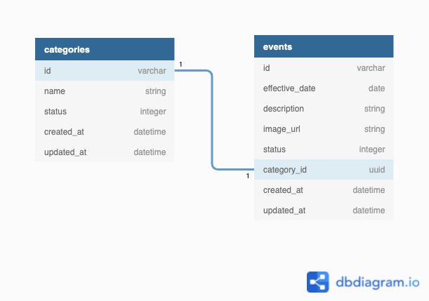

# Efemerides

## Features

- You can check the events by filtering by `by_effective_date`, `matching_description`, `current`.
- When you archive a category, it archives the associated events.
- By default, the events with the date of the current day are returned.

## Setup

To configure the connection with the database you must change the credentials in the file `.env`.

Just run the setup script to configure the app:

```bash
  bin/bundle
```

then create the db

```bash
  rails db:create
  rails db:migrate
```

then use initial data run the seed

```bash
  rails db:seed
```

then run the tests

```bash
  rspec
```

## Database model




## Environment dependencies

* Ruby 2.7.1
* PostgreSQL

## Endpoints

### Categories

- Method: `POST`
- URL: `v1/categories`
- Request example:

```json
  {
    "name": "deportes"
  }
```

- Method: `PUT`
- URL: `v1/categories/:category_id`
- Request example:

```json
  {
    "name": "deportes",
    "status": "archived"
  }
```

- Method: `GET`
- URL: `v1/categories/:category_id`

### Events

- Method: `POST`
- URL: `v1/events`
- Request example:

```json
  {
    "description": "dia de la independencia",
    "effective_date": "10/11/2021",
    "image_url": "http://www.image.com",
    "category_id": "e4b31ec6-bb3e-4370-86db-4ac472de6d56"
  }
```

- Method: `PUT`
- URL: `v1/events/:event_id`
- Request example:

```json
  {
    "description": "dia de la independencia",
    "effective_date": "10/11/2021",
    "image_url": "http://www.image.com",
    "category_id": "e4b31ec6-bb3e-4370-86db-4ac472de6d56"
  }
```

- Method: `GET`
- URL: `v1/events/:event_id`
